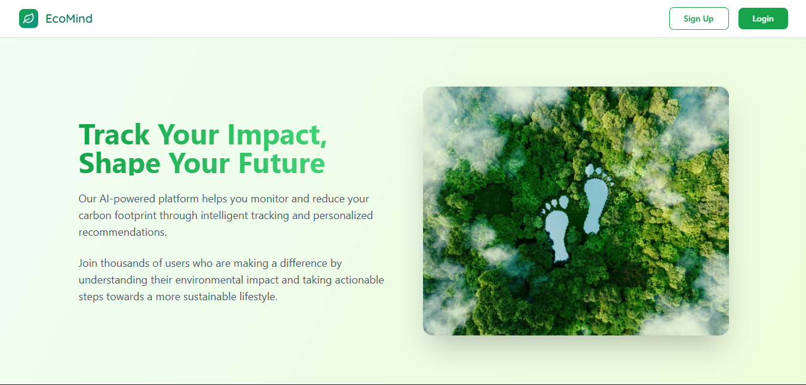
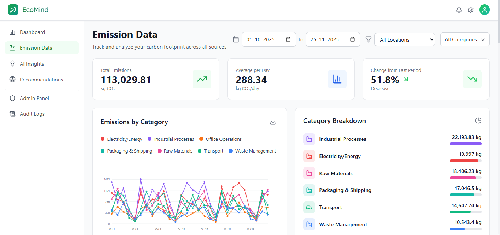

# EcoMind

Build sustainability like a product, not a spreadsheet.

EcoMind is a full-stack carbon intelligence platform that helps teams capture emissions data, understand trends, and act on AI-guided recommendations. It combines operational tracking, accountability workflows, and decision support in one place.

## Why EcoMind

Most carbon tools stop at reporting. EcoMind is built for action:

- Track real-world emission records across workflows.
- Turn raw data into understandable dashboards.
- Add AI-assisted recommendations to reduce impact.
- Maintain traceability with auditable activity history.

## Core Capabilities

- Authentication and role-based access for secure organization use.
- Emission data entry, storage, and analysis.
- AI insight and recommendation pages for practical reductions.
- Audit logs for transparency and compliance trails.
- Sustainability dashboard views for progress monitoring.
- Admin space for user and organization management.

## Technology Stack

- Frontend: SvelteKit and Tailwind CSS
- Backend: FastAPI (Python)
- Database: MySQL
- AI Layer: Python-driven analytics and recommendation logic

## Quick Tour

- Home page for platform overview and navigation.
- Emission data page for input and trend tracking.
- AI insights and recommendations for reduction strategies.
- Admin and audit modules for governance.

## Screenshots

### Home


### Emissions


## Repository Layout

```text
Raksha/
|- backend/                     FastAPI services and database logic
|  |- main.py                   Backend entry point
|  |- check_structure.py        Database/schema checks
|  |- probe_emission_records_sql.py
|  \- insertValues/             Data insertion scripts
|- frontend/                    SvelteKit application
|  |- package.json              Frontend dependencies and scripts
|  |- src/                      Routes, stores, and UI components
|  \- static/                   Public static assets
|- other/                       Images and supporting resources
\- README.md
```

## Getting Started

1. Clone the repository.
2. Configure backend environment values for MySQL access.
3. Start the FastAPI backend from the backend folder.
4. Install frontend dependencies in the frontend folder.
5. Run the SvelteKit development server and open the app in browser.

## Vision

EcoMind aims to make sustainability operations measurable, explainable, and continuous so organizations can move from periodic reporting to everyday climate-aware decisions.
